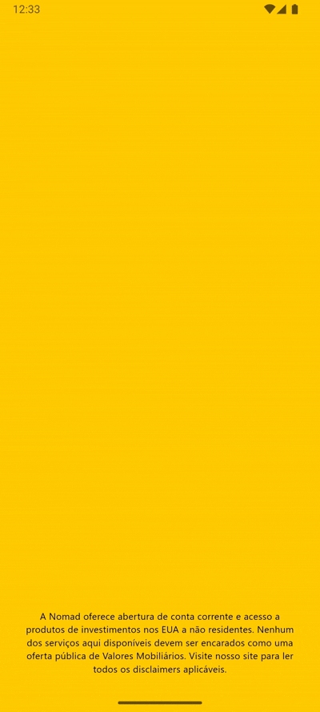
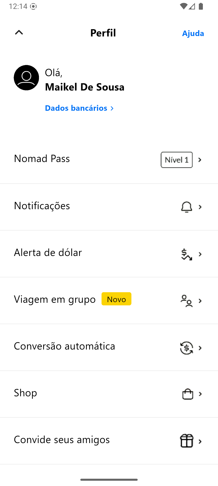
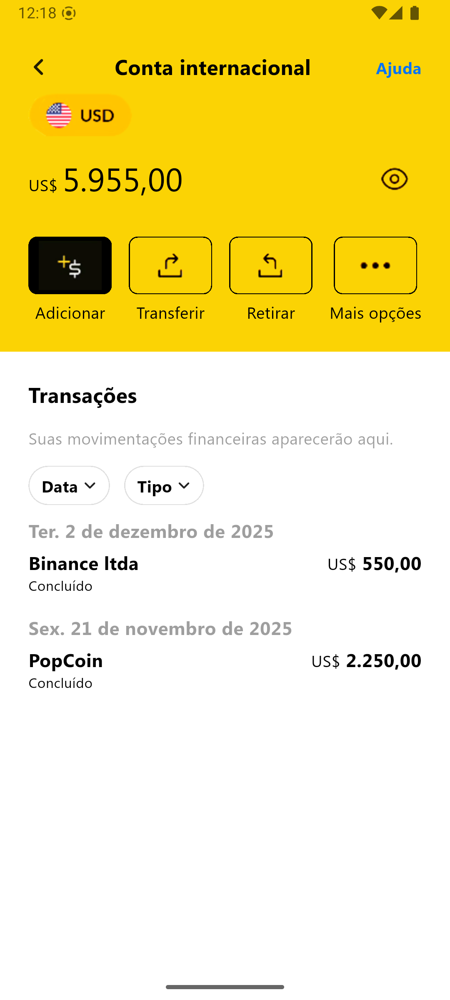

# Nomad UI Challenge
Este app foi um desafio pessoal que busquei realizar para aprimorar meus conhecimentos em reatividade, gerenciamento de estados, animações e criação de componentes de UI.

---
### Demonstrações / Screenshots

<p align="center">
  
  
   
  
</p>

---

### Badges


---

### 🚀Tecnologias e Arquitetura

- Framework: Flutter
- Linguagem: Dart
- Gerenciador de estado: Provider


---

### 🧠 Boas Práticas de Engenharia
- Reuso de componentes e consistência visual.
- Responsabilidade única em cada classe.
- Modularização do código.

---

### 📱 Objetivo
Criar uma experiência envolvente e apaixonante tendo como referência o aplicativo da Nomad.

---

### ▶️ Executando o projeto

```bash
# Instalação do projeto
flutter pub get

# Executar em modo desenvolvimento  
flutter run --profile --dart-define-from-file=.env/dev_env.json

# Build para produção
flutter build apk --release --dart-define-from-file=.env/dev_env.json
```

---

### 🧑‍💻 Autor
Pedro Camargo Desenvolvedor Flutter | Arquitetura de Software | Design de Sistemas Modernos)
